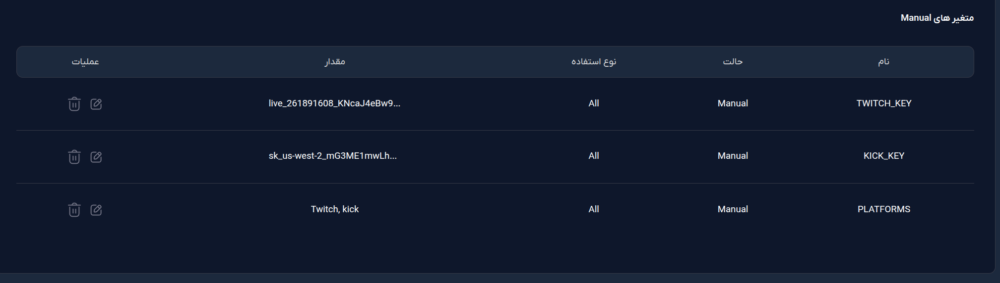
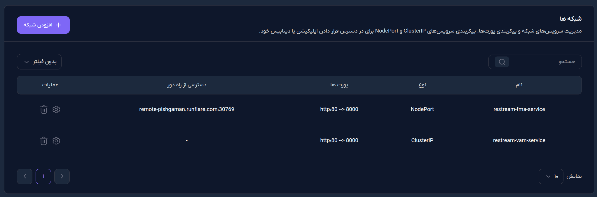
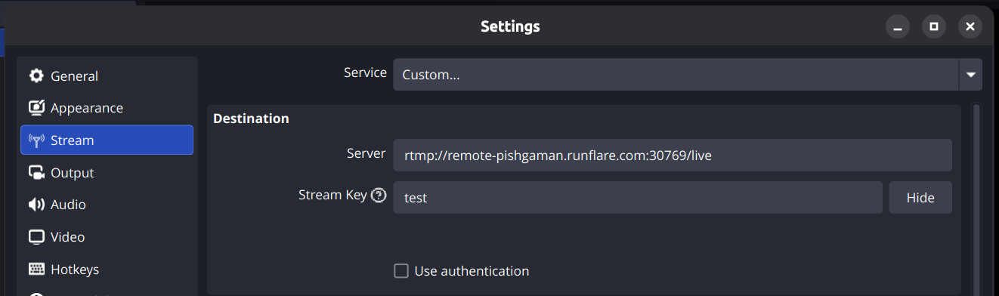

# RTMP Restream Bridge for Restricted Networks (Twitch & Kick & YouTube)

This guide walks you through setting up a lightweight Docker RTMP restream bridge using Nginx and Stunnel on Runflare. It routes a single OBS stream to Twitch and Kick (RTMPS) with zero transcoding, bypassing strict national firewalls or Layer 7 web proxies by using direct TCP connections.

---

## 1. Create a Runflare Project

First, you need to set up the foundational project in your Runflare account.

1. **Login or Register** to your [Runflare account](https://portal.runflare.com/).
2. Click on **Create Project (ایجاد پروژه)**.
3. Select any domain name you prefer.
4. **Select a Datacenter**: For the best unthrottled connection from inside the country, it is highly recommended to select an Iranian datacenter. Choose **Pishgaman IRAN (پیشگامان ایران)**.
5. **Select Resources**: The minimum resources are perfectly fine for this step.
6. Click to finalize and create the project.

---

## 2. Create the Docker Service

Next, we will create the container environment that will run the restream bridge.

1. Go to the **Services (سرویس ها)** section of your new project and click **Create (+ ایجاد)**.
2. Enter a **Service Name** of your choice.
3. In **Structure**, select **Docker**.
4. **Expose Port**: Enter `8000` (this is the port our Nginx server listens on).
5. **Select Resources**: You can drag the sliders to the maximum available for your project, as we won't be adding any other services here.
6. Click to create the service.

---

## 3. Deploy the Source Code

Now we need to deploy the actual bridge code to the service you just created. The code is hosted at `https://github.com/khiar-shoor/restream.git`. 

Go to the **New Deployment (استقرار جدید)** section. You can deploy using either of these two methods:

### Option A: ZIP Upload (Recommended)
1. Download the project as a `.zip` file from the GitHub repository.
2. Drag and drop, or upload the ZIP file directly into the deployment area.
3. Start the deployment.

### Option A: Direct GitHub Link
1. Select **Git**.
2. Choose **Classic GitHub (گیت هاب کلاسیک)**.
3. Enter the repository URL: `https://github.com/khiar-shoor/restream.git`
4. Set the **Branch** to `main`.
5. Leave the Token field completely blank.
6. Select the last commit from the bottom of the page.
7. Start the deployment.

---

## 4. Environment Variables Configuration

To keep your stream keys secure, we use Environment Variables. The bridge will read these automatically.

1. Look for the **Environment Variables (متغیرهای محیطی)** section in the right-side pane of your deployed app.
2. Add the following variables:
   * **`TWITCH_KEY`**: Your secret Twitch stream key (found in your Twitch Creator Dashboard).
   * **`KICK_KEY`**: Your secret Kick stream key (found in your Kick Creator Dashboard).
   * **`YOUTUBE_KEY`**: Your secret YouTube stream key (found in your YouTube Live Control Room).
   * **`PLATFORMS`**: Controls which platforms you are broadcasting to.
     * Set this to **`twitch, kick, youtube`** to stream to all three.
     * Set it to any combination like **`youtube, kick`** to stream to specific ones.
     * (If left empty, it defaults to all three).
   * **`OBS_STREAM_KEY`** *(Optional but Recommended)*: This acts as a password to secure your custom server so random people cannot stream to your channels.
     * Type a secure password here (e.g., **`MySecretPassword123`**). Avoid spaces or special characters.
     * If you leave this blank, your server will be "open" and accept a stream from anyone who knows your port number.

Make sure to save your environment variables and let the container restart to apply the changes.

*Note: You do not need to manually restart any containers. Whenever you update or change an environment variable (like switching platforms), Runflare automatically restarts the container. Just wait a few moments for the new deployment to finish before starting your stream in OBS.*

---

## 5. Network Configuration (Crucial Step)

Cloud providers like Runflare route standard traffic through a "Layer 7 Proxy" (an HTTP/HTTPS web bouncer). RTMP is raw TCP video data, NOT website data, so the default web proxy will drop your stream instantly. 

You must bypass the web proxy by using a **NodePort** connection.

1. Look for the **Networks (شبکه ها)** section in the right-side pane of your deployed app.
2. If there is a default web proxy (e.g., `Type: ClusterIP`, `Port: http:80 -> 8000`), **ignore it or leave it as is**. Do not use its provided `.runflare.run` domain for OBS.
3. Click to **Add Network (افزودن شبکه)**.
4. Set the **Type (نوع)** to **`NodePort`**.
5. Set the **Target Port (تارگت پورت)** to **`8000`**.
6. Click **Add (افزودن)**.
7. Runflare will now generate a direct routing address and a specific external port under the **Remote Access (دسترسی از راه دور)** column (e.g., `remote-pishgaman.runflare.com:30769`). Copy this entire string.

---

## 6. OBS Studio Setup

Now that your server is running and your direct NodePort is open, configure OBS to send your single stream to the bridge.

1. Open **OBS Studio** and go to **Settings > Stream**.
2. **Service**: Select **Custom**.
3. **Server**: Enter your Runflare NodePort address followed by **`/live`**.
   * *Example:* `rtmp://remote-pishgaman.runflare.com:30769/live` (Make sure to replace 30769 with your actual 5-digit port).
4. **Stream Key**:
   * If you set an **`OBS_STREAM_KEY`** in your Runflare environment variables, enter that exact password here.
   * If you left it blank in Runflare, you can type anything here (like `test`) or leave it blank—it won't matter.
5. Click **Apply**, then hit **Start Streaming**.

Your stream will now hit your custom Nginx server and automatically branch out to your selected platforms!

---

## 🛑 Stopping & Starting Your Service (Cost Saving)

To avoid incurring charges while you are not actively streaming, you can easily pause your Runflare service.

### When you finish your stream:
* Go to your **Runflare Dashboard**.
* Navigate to the **Projects** section and select your project.
* Click the **Stop** button (⏻) to halt the service. It will no longer cost you money while paused.

### When you are ready to stream again:
* Return to the same project section in the dashboard.
* Click the **Start** button (▷).
* Wait just a few seconds for the service to boot up, and you are good to go!
